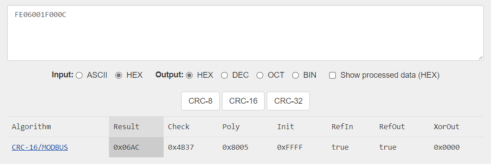

# Senseair S8 library for the Arduino framework

- Uses HardwareSerial
- Tested on the ESP32
- Able to read and write ABC period

### Usage

#### initialize

```cpp
#include <SenseairS8.h>

// define RX2 and TX2 to change pins, by default RX2=16 TX2=17
SenseairS8 co2(2);

void setup() {
    co2.begin();
}
```

(rx connects to UART_TX on the sensor, tx to UART_RX)

#### read co2 concentration and sensor status

```cpp
SenseairS8::SensorStatus status = co2.readSensorStatus();
if (status.isValid) {
    uint16_t co2ppm = status.co2;
    bool alarm = !status.alarmOutputStatus; // inverted due to open collector
    bool outOfRange = status.outOfRange;
    bool error = status.anyError;
    // refer to SenseairS8::SensorStatus for all available members
}
else {
    Serial.printf("Error!\n");
}
```

or just do

```cpp
uint16_t co2ppm = co2.readSensorStatus().co2;
```

#### read sensor information

```cpp
SenseairS8::SensorInfo info = co2.readSensorInfo();
if (info.isValid) {
    uint32 sensorTypeID = info.sensorTypeID; // usually 0x00010E?
    uint32 sensorID = info.sensorID; // serial number
    Serial.printf("FW verion: %d.%d", info.fwVersion >> 2, info.fwVerion & 0xFF); // mine is 5.12
    // refer to SenseairS8::SensorInfo for all available members
}
else {
    Serial.printf("Error!\n");
}
```

or you can print everything it reads

```cpp
co2.printSensorInfo();
```

prints

```
Senseair S8: FULL SENSOR INFO
      Sensor Type ID:      10E
           Sensor ID:  753DF23
    Firmware Version: 5.12
  Memory Map Version: 49
           Space CO2: 790ppm
        Meter Status: 
 Alarm Output Status: true
   PWM Output Status: false
          ABC Period: 180 hours
```

Note that Alarm Output Status is inverted due to Open Collector according to the datasheet.

#### set ABC period

This library does not include CRC calculation code, because data corruption is not all that common, and even if it happened it should be fine in the
non-industrial application that we are probably using in.\
Usually an error will occur at the first byte read (reads 00 instead of FE) when the delay between sending the command and reading is too short for some
reason (even if I wait for Serial.available()... no idea). Currently I wait for 50ms, which seems to be very reliable. My point is, if the first byte FE reads
correctly, the rest is usually correct too.

For setting the ABC period, you will need to calculate the CRC except if you want to set it back to default (180h = 7.5d) or disable it.

```cpp
// set to default of 7.5 days
co2.setABCPeriod(); // = setABCPeriod(180); = setABCPeriod(180, 0x74AC);
// disable
co2.setABCPeriod(0); // = setABCPeriod(0, 0x03AC);
// custom value
co2.setABCPeriod(duration, crc16modbusOf(0xFE06001F0000 & duration));
```

For example, to set ABC period to half a day = 12 hours = `0x000C`, calculate CRC of `0xFE06001F000C` which is `0x06AC`\
\
[crccalc.com](https://crccalc.com/?crc=FE06001F000C&method=crc16&datatype=hex&outtype=0)

```cpp
if (co2.setABCPeriod(12, 0x06AC))
    Serial.printf("Success!\n");
```